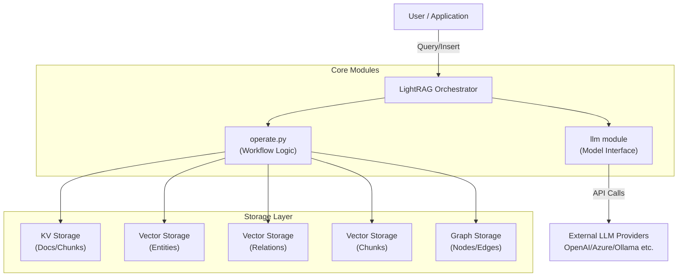
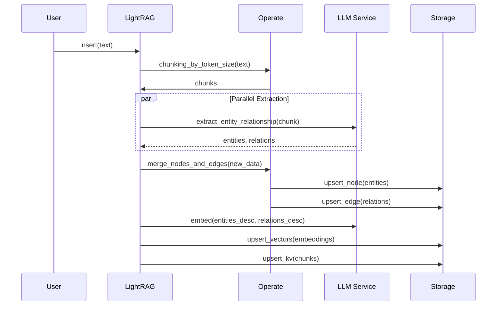
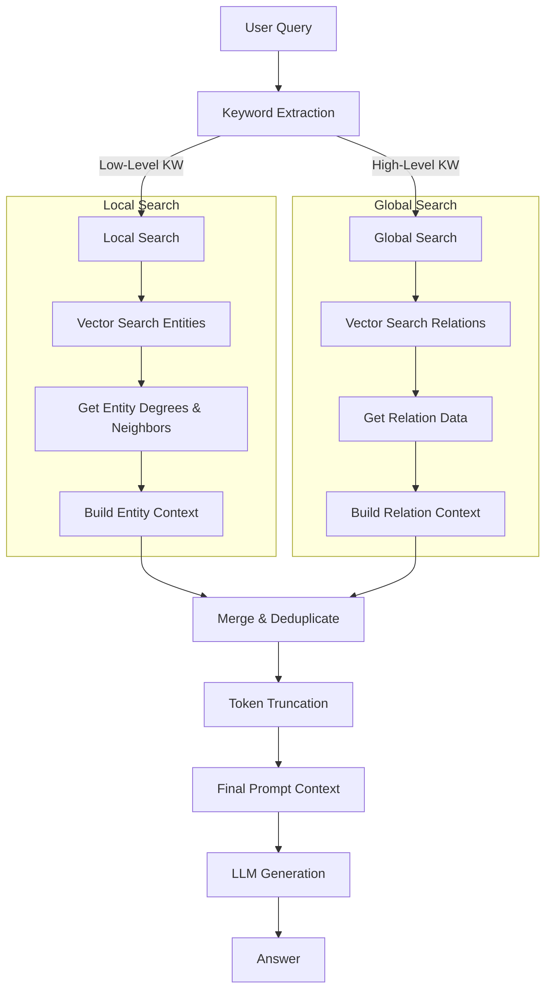

# LightRAG Technical Specification

## 1. Executive Summary

LightRAG is a specialized Retrieval-Augmented Generation (RAG) framework designed to be simple, fast, and cost-effective. Unlike traditional RAG systems that rely solely on vector similarity, LightRAG integrates **Graph-based** and **Vector-based** retrieval strategies. It builds a Knowledge Graph (KG) from documents to capture complex relationships and entities, enabling "Global" (high-level summary) and "Local" (specific detail) query capabilities. The system is built with an "Async-First" architecture to handle high-throughput ingestion and retrieval.

## 2. System Architecture

### 2.1 High-Level Architecture

The system follows a modular architecture where the **LightRAG** orchestrator coordinates interactions between the user, the LLM service, and four distinct storage backends.

### 2.2 Functionality Breakdown

*   **`LightRAG` (Orchestraator)**: The main entry point. It initializes storage, manages configuration (using `lightrag.py`), and exposes `insert` and `query` methods.
*   **`operate.py` (The Engine)**: Contains the business logic for:
    *   **Chunking**: Splitting text by token size.
    *   **Extraction**: Prompting LLMs to identify Entities and Relationships.
    *   **Retrieval**: Implementing the Logic for Local, Global, and Hybrid search.
    *   **Consolidation**: Merging duplicate entities and updating the graph.
*   **`base.py` (Interfaces)**: Defines abstract base classes (`BaseGraphStorage`, `BaseKVStorage`, `BaseVectorStorage`) to ensure backend agnosticism.
*   **Storage Implementations**:
    *   **Graph**: NetworkX (local), Neo4j, ArangoDB, PostgreSQL (Apache AGE).
    *   **Vector**: NanoVectorDB (local), Milvus, Chroma, Qdrant, PostgreSQL (pgvector).
    *   **KV**: JSON (local), Redis, MongoDB, PostgreSQL.

## 3. Data Model

LightRAG uses a hybrid data model combining structured graph data with unstructured vector embeddings.

### 3.1 Entities & Nodes
*   **Structure**: `{"entity_name": "...", "entity_type": "...", "description": "...", "source_id": "..."}`
*   **Storage**:
    *   **Graph**: Stored as Nodes with properties.
    *   **Vector**: Description + Name embedded for similarity search.

### 3.2 Relationships & Edges
*   **Structure**: `{"src_id": "A", "tgt_id": "B", "keywords": [...], "description": "...", "weight": float}`
*   **Storage**:
    *   **Graph**: Stored as Edges with properties.
    *   **Vector**: Description + Keywords embedded for global (relationship-centric) search.

### 3.3 Documents & Chunks
*   **Document**: Raw input text.
*   **Chunk**: Token-limited segment of a document.
*   **Storage**: KV Store maps `id -> content`. Chunks can also be embedded (Naive RAG).

## 4. Key Workflows

### 4.1 Ingestion Pipeline (Indexing)

The ingestion process transforms raw text into a queryable Knowledge Graph through a multi-step pipeline.

#### Detailed Steps

1.  **Document Deduplication**:
    *   Calculates MD5 hash of input documents.
    *   Skips documents that have already been processed to avoid redundant computation.

2.  **Chunking (`chunking_by_token_size`)**:
    *   Splits documents into manageable segments based on token count (default: 1200 tokens).
    *   Maintains an overlap (default: 100 tokens) to preserve context across boundaries.
    *   Uses `tiktoken` for accurate tokenization.

3.  **Entity & Relationship Extraction**:
    *   **Prompting**: Uses `entity_extraction_system_prompt` to instruct the LLM to identify entities (e.g., Person, Org, Geo) and their relationships.
    *   **Multi-Gleaning**: Optionally performs multiple extraction passes to catch missed entities.
    *   **Structured Parsing**: Converts LLM output (often in specific delimiter-separated formats like `("entity"<|>NAME<|>TYPE<|>DESC)`) into structured objects.

4.  **Graph Construction & Update**:
    *   **Entity Merging**: Combines descriptions for the same entity from different chunks.
    *   **Relationship Merging**: Aggregates weights and combines descriptions for identical edges.
    *   **Storage**: Persists Nodes and Edges to the Graph Storage (e.g., NetworkX, Neo4j, AGE).

5.  **Vector Indexing**:
    *   **Entity Embedding**: Embeds `Name + Description` for entity-centric search.
    *   **Relationship Embedding**: Embeds `Keywords + Description` for relationship-centric (global) search.
    *   **Chunk Embedding**: Embeds raw chunk text for fallback or hybrid retrieval.

### 4.2 Retrieval Pipeline (Query)

LightRAG implements a sophisticated query pipeline that adapts to the nature of the user's question.

#### Query Modes

1.  **Local Query (Entity-Centric)**:
    *   **Goal**: Answer specific questions about details (e.g., "What is the battery life of X?").
    *   **Mechanism**:
        *   Extracts specific entity names (keywords).
        *   Performs Vector Search on the **Entity Index**.
        *   Retrieves 1-hop neighbors from the Knowledge Graph.
        *   Constructs context from Entity Descriptions + Neighbor Relations.

2.  **Global Query (Theme-Centric)**:
    *   **Goal**: Answer broad, summary questions (e.g., "What are the main themes in this dataset?").
    *   **Mechanism**:
        *   Extracts high-level concepts/keywords.
        *   Performs Vector Search on the **Relationship Index**.
        *   Retrieves top-ranked edges (relationships) based on semantic similarity.
        *   Constructs context primarily from Relationship Descriptions.

3.  **Hybrid Query (Best of Both)**:
    *   **Goal**: Provide a comprehensive answer covering both specific details and broad context.
    *   **Mechanism**: Executes both Local and Global strategies, merges the distinct contexts (deduplicating overlapped chunks), and prompts the LLM to synthesize the information.

#### Retrieval Algorithm

1.  **Keyword Extraction**: Uses LLM to separate query into `high_level_keywords` (for global) and `low_level_keywords` (for local).
2.  **Dual Context Retrieval**:
    *   Queries `entities_vdb` with low-level keywords.
    *   Queries `relationships_vdb` with high-level keywords.
3.  **Context Combination & Pruning**:
    *   Merges results from both streams.
    *   **Token Truncation**: Strictly enforces token limits (e.g., 5000 tokens) by prioritizing the most relevant chunks/entities.
4.  **Generation**: Sends the finalized, token-bounded context to the LLM with a specific generation prompt.

## 5. Core Algorithms & Logic

### 5.1 Retrieval Strategy (`operate.py`)
The `_build_query_context` function orchestrates the 4-stage retrieval:
1.  **Search**: Calls `_perform_kg_search` to get raw entities/relations/chunks.
2.  **Truncate**: Calls `_apply_token_truncation` to fit LLM context windows, prioritizing highly relevant/dense information.
3.  **Merge**: `_merge_all_chunks` combines text chunks associated with the selected entities/relations.
4.  **Build**: `_build_context_str` assembles the final prompt.

### 5.2 Concurrency Control
LightRAG uses `priority_limit_async_func_call` (in `utils.py`) to manage LLM rate limits.
*   It implements a **Priority Queue** to manage request ordering.
*   It includes **Health Checks** to detect and recover from stuck tasks.
*   It wraps execution in robust **Timeout** handling logic.

### 5.3 Caching
*   **LLM Cache**: Responses are cached (hashed by prompt + args) to save costs and reduce latency on repeated queries.
*   **KV Storage**: Used to store the cache, enabling persistence across runs if a persistent KV backend (like Redis/Disk) is used.

## 6. Configuration & Extensibility

*   **Environment Variables**: Heavily used for setup (`OPENAI_API_KEY`, `LIGHTRAG_LOG_DIR`).
*   **Storage Swapping**: Users can mix and match storage backends (e.g., Neo4j for Graph + Milvus for Vector + Redis for KV) by passing different storage class instances to `LightRAG`.
*   **Custom Prompts**: System prompts (in `prompt.py`) can be overridden via `global_config` to tailor extraction/generation styles (e.g., changing the language or detail level).
